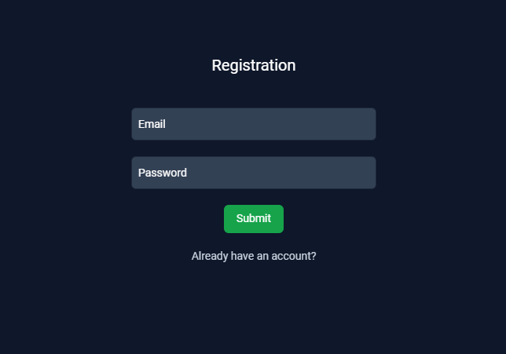

## About program
It's a program designed to control your budget. It is similar to what is done in any banking service (it is created automatically). But in the case of this program it is filled out manually.

## What is used
Technologies such as Nest for Backend part and React for Frontend part are used. The main programming language is TypeScript. 

## To start the program
Before everything, you need to create a database and design the .env file this way: 
```env
JWT_SECRET=
DB_HOST=''
DB_PORT=
DB_USERNAME=''
DB_PASSWORD=''
DB_NAME=''
```
After that read the .Readme files located in the corresponding parts of the project

## Server structure

<p align="center">
  <a href="http://nestjs.com/" target="blank"></a>
</p>

## Web project

#### Registration

<p align="center">
  <a href="http://nestjs.com/" target="blank"></a>
</p>

#### Categories 

<p align="center">
  <a href="http://nestjs.com/" target="blank"></a>
</p>

#### Transaction 

<p align="center">
  <a href="http://nestjs.com/" target="blank"></a>
</p>